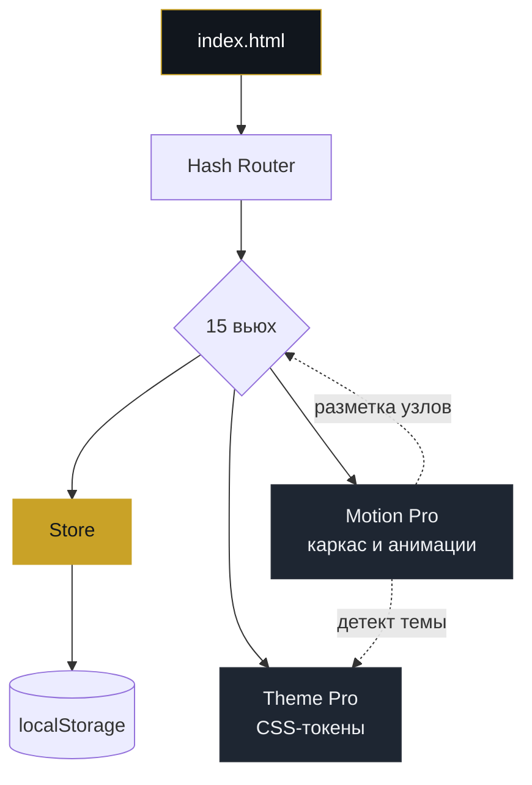

<div align="center">

<picture>
  <source media="(prefers-color-scheme: dark)" srcset="assets/logo-dark.svg">
  <source media="(prefers-color-scheme: light)" srcset="assets/logo-light.svg">
  
</picture>

# Стрелолист

**Платформа системного изучения тестирования.**
23 модуля, 69 тем, 300 вопросов, карта знаний и личное портфолио QA-инженера.

<br>

[](https://твой-ник.github.io/strelolist/)
[](#дизайн-система)


<br>


</div>

---

Стрелолист закрывает разрыв между «прочитал теорию» и «могу показать работу». Программа разбита на маршрут из 23 модулей, каждая тема подкреплена вопросами с эталонными ответами, а результат складывается в портфолио артефактов — тест-план, чек-лист, баг-репорт, матрица трассировки.

Работает офлайн, без сборки и без сервера: открыл `index.html` — платформа готова. Данные живут в `localStorage`, никуда не уходят.

<div align="center">

**300** вопросов · **69** тем · **75** терминов · **10** шаблонов артефактов · **0** зависимостей

</div>

## Содержание

[Возможности](#возможности) ·
[Архитектура](#архитектура) ·
[Дизайн-система](#дизайн-система) ·
[Быстрый старт](#быстрый-старт) ·
[Структура](#структура-проекта) ·
[Данные](#данные-и-приватность) ·
[Дорожная карта](#дорожная-карта)

## Возможности

| Раздел | Что делает |
|---|---|
| **Учебный маршрут** | 8 модулей с прогрессом, техники тест-дизайна, зависимости между темами |
| **Карта знаний** | три уровня — База, Практика, Углубление — с процентом покрытия |
| **Курс** | 23 модуля, поиск по темам, фильтр по статусу, контрольный тест |
| **Вопросы** | 300 карточек: определения, объяснения, практика. Свой ответ против эталона |
| **Повторение** | интервальное повторение, разбивка на просроченные / сегодня / сложные |
| **Заметки** | Markdown-редактор, теги, важность, категории, дублирование и экспорт |
| **Практика** | 10 шаблонов артефактов: тест-план, стратегия, чек-лист, баг-репорт |
| **Портфолио** | собранные артефакты, режим презентации для собеседования |
| **Pomodoro** | таймер с профилями 25/5, счётчик завершённых сессий, звуковой сигнал |
| **Статистика** | 15 метрик, время по модулям, экспорт и импорт всего прогресса |
| **Словарь** | 75 терминов, алфавитный фильтр, поиск по определениям |

> [!TIP]
> Начни с **Сегодня** — экран собирает план на день из просроченных повторений, незакрытых тем и незавершённых артефактов.

## Архитектура

SPA без фреймворка и без сборки. Hash-роутер переключает вьюхи, состояние держится в одном сторе, слой представления отделён от слоя данных.



Ключевое решение: `motion.js` не требует правок разметки. Он сам замеряет светлоту фона и выставляет тему, размечает кнопки на обычные / основные / опасные по тексту, находит строки «имя — значение», плитки и алфавит по структуре DOM. Дизайн-система накладывается на существующий рендер без переписывания вьюх.

## Дизайн-система

**Theme Pro v3.1** — токены на CSS Custom Properties, две темы, переключение без перерисовки.

| Токен | Светлая | Тёмная | Назначение |
|---|---|---|---|
| `--gold` | `#C9A227` | `#C9A227` | акцент, прогресс, активное состояние |
| `--canvas` | `#F6F3ED` | `#0E131A` | фон приложения |
| `--surface` | `#FFFFFF` | `#1A1F27` | карточки, панели |
| `--ink` | `#1C1F23` | `#EEF0F3` | основной текст |
| `--ink-soft` | `#5B6470` | `#AAB2BD` | вторичный текст |
| `--line` | `#E6E2DA` | `#2A303B` | границы |

**Motion Pro v3.1** — движение как часть интерфейса, а не украшение:

- аврора-фон — три радиальных градиента, дрейф 34 с
- спотлайт под курсором и 3D-наклон карточек до 5°
- магнитный бегунок сайдбара на пружине `cubic-bezier(.34,1.56,.64,1)`
- полоса прочитанного в шапке, смена заголовка через blur-swap
- переходы между разделами на View Transitions API
- каскадное появление блоков через Intersection Observer

Всё движение уважает `prefers-reduced-motion: reduce`.

## Быстрый старт

```bash
git clone https://github.com/твой-ник/strelolist.git
cd strelolist
```

Дальше любой вариант:

```bash
open index.html          # просто открыть файл
npx serve .              # локальный сервер
python3 -m http.server   # если нужен Python
```

Сборка не нужна — ни npm, ни бандлера, ни транспиляции.

> [!NOTE]
> Требуется современный браузер: используются `:has()`, `color-mix()`, View Transitions. Chrome 111+, Safari 17+, Firefox 121+.

## Структура проекта

<details>
<summary><b>Дерево файлов</b></summary>

```
strelolist/
├── index.html                 # точка входа SPA
├── css/
│   ├── theme-pro.css          # дизайн-система, токены, обе темы
│   └── main.css               # базовые стили приложения
├── js/
│   ├── main.js                # роутер, вьюхи, рендер
│   ├── store.js               # состояние и localStorage
│   ├── data/                  # модули, вопросы, словарь, шаблоны
│   └── utils/
│       └── motion.js          # каркас, детект темы, анимации
├── assets/                    # лого, превью, скриншоты
└── .github/workflows/deploy.yml
```

</details>

<details>
<summary><b>Горячие клавиши</b></summary>

| Комбинация | Действие |
|---|---|
| <kbd>/</kbd> | фокус в поиск |
| <kbd>Ctrl</kbd> + <kbd>S</kbd> | сохранить заметку |
| <kbd>Esc</kbd> | закрыть модальное окно |
| <kbd>←</kbd> <kbd>→</kbd> | предыдущий и следующий вопрос |
| <kbd>Space</kbd> | старт и пауза Pomodoro |

</details>

<details>
<summary><b>Скриншоты</b></summary>

| Главная | Учебный маршрут |
|---|---|
|  |  |

| Вопросы | Статистика |
|---|---|
|  |  |

</details>

## Данные и приватность

Ни одного сетевого запроса. Весь прогресс — ответы, заметки, артефакты, сессии Pomodoro — лежит в `localStorage` браузера.

- **Экспорт** — Настройки → Экспорт данных, выгрузка в JSON
- **Импорт** — восстановление из файла на другом устройстве
- **Сброс** — полная очистка с подтверждением

> [!WARNING]
> Очистка данных сайта в браузере удалит прогресс. Делай экспорт перед сменой устройства.

## Дорожная карта

- [x] Дизайн-система Theme Pro v3
- [x] Фиксированный каркас: шапка и сайдбар
- [x] Тёмная тема без белых провалов на всех 15 экранах
- [x] Интервальное повторение
- [ ] PWA и офлайн-кэш через Service Worker
- [ ] Экспорт портфолио в PDF
- [ ] Синхронизация между устройствами через файл
- [ ] Расширение до 500 вопросов

## Лицензия

[MIT](LICENSE) © твой-ник

<div align="center">
<br>
<sub>Собрано на ванильном JS. Без фреймворков, без зависимостей, без сборки.</sub>
</div>
