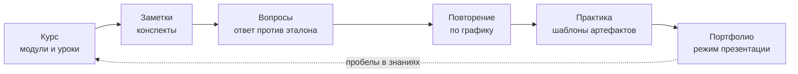
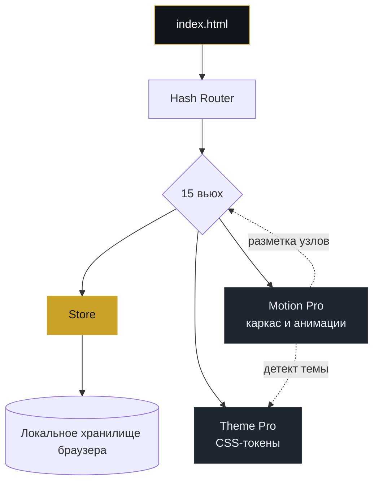

<div align="center">


# qa-study-portfolio

**Платформа системного изучения ручного тестирования**<br>
23 модуля · 69 тем · 300 вопросов · карта знаний · личное портфолио QA-инженера

<br>


<!--
  Демо-бейдж. Добавьте после включения GitHub Pages
  (Settings → Pages → Deploy from a branch → main / root):

  [](https://konstantin532.github.io/qa-study-portfolio/)
-->

<br>


<sub>Переключение темы, навигация по маршруту, работа с вопросами · 15 секунд</sub>

</div>

---

## О проекте

**qa-study-portfolio** закрывает разрыв между «прочитал теорию» и «могу показать работу».

Программа разбита на маршрут из 23 модулей. Каждая тема подкреплена вопросами с эталонными ответами, а результат складывается в портфолио артефактов: тест-план, чек-лист, баг-репорт, матрица трассировки.

Приложение работает полностью офлайн, без сборки и без сервера: открыл `index.html` — и всё готово. Ваши данные остаются в браузере и никуда не отправляются.

<div align="center">

| **300** | **69** | **75** | **10** | **15** | **0** |
| :---: | :---: | :---: | :---: | :---: | :---: |
| вопросов | тем | терминов | шаблонов артефактов | экранов | зависимостей |

</div>

## Содержание

[Для кого](#для-кого) · [Чем отличается](#чем-отличается) · [Возможности](#возможности) · [Скриншоты](#скриншоты) · [Как учиться](#как-учиться) · [Быстрый старт](#быстрый-старт) · [Архитектура](#архитектура) · [Дизайн-система](#дизайн-система) · [Доступность](#доступность) · [Структура проекта](#структура-проекта) · [Данные и приватность](#данные-и-приватность) · [QA Deco](#qa-deco) · [Дорожная карта](#дорожная-карта) · [Участие](#участие-в-проекте) · [FAQ](#faq)

## Для кого

| Кто вы | Что получите |
| --- | --- |
| **Свитчер в QA** | Маршрут вместо хаоса из случайных статей: от терминов до первых артефактов. |
| **Начинающий тестировщик** | Теорию вы знаете, но на собеседовании кроме сертификата показать нечего. Здесь появится портфолио. |
| **Студент курсов** | Конспекты, вопросы и артефакты в одном месте, параллельно с обучением. |
| **Действующий QA** | 300 вопросов с эталонными ответами, чтобы освежить базу перед собеседованием. |

## Чем отличается

| | Видеокурсы | Notion / Obsidian | **qa-study-portfolio** |
| --- | :---: | :---: | :---: |
| Готовая программа обучения | да | нет | **да** |
| Вопросы с эталонными ответами | редко | нет | **300 штук** |
| Интервальное повторение | нет | через плагины | **встроено** |
| Шаблоны QA-артефактов | нет | вручную | **10 шаблонов** |
| Портфолио для собеседования | нет | нет | **режим презентации** |
| Работа офлайн | нет | частично | **полностью** |
| Где лежат данные | у платформы | в облаке | **только у вас в браузере** |
| Цена | от бесплатно | подписка | **бесплатно** |

## Возможности

| Раздел | Что делает |
| --- | --- |
| **Сегодня** | Собирает план на день из просроченных повторений, незакрытых тем и незавершённых артефактов. |
| **Учебный маршрут** | 8 этапов с прогрессом, техники тест-дизайна, зависимости между темами. |
| **Карта знаний** | 3 уровня — База, Практика, Углубление — с процентом покрытия. |
| **Курс** | 23 модуля, поиск по темам, фильтр по статусу, контрольный тест. |
| **Вопросы** | 300 карточек: определения, объяснения, практика. Можно сравнить свой ответ с эталоном. |
| **Повторение** | Интервальное повторение с разбивкой на просроченные, сегодняшние и сложные карточки. |
| **Заметки** | Markdown-редактор, теги, категории, дублирование и экспорт. |
| **Практика** | 10 шаблонов артефактов: тест-план, стратегия, чек-лист, баг-репорт и другие. |
| **Портфолио** | Собранные артефакты и режим презентации для собеседования. |
| **Pomodoro** | Таймер с профилями 25/5, счётчик сессий и звуковой сигнал. |
| **Статистика** | 15 метрик, время по модулям, экспорт и импорт прогресса. |
| **Словарь** | 75 терминов, алфавитный фильтр, поиск по определениям. |
| **Материалы** и **Настройки** | Справочные материалы и системные параметры. |

> [!TIP]
> Начните с раздела **Сегодня**: экран сам подскажет, что повторить и что довести до конца.

## Скриншоты

<table>
  <tr>
    <td align="center" width="50%">
      <br>
      <sub><b>Главная</b> — обзор прогресса</sub>
    </td>
    <td align="center" width="50%">
      <br>
      <sub><b>Сегодня</b> — задачи на день</sub>
    </td>
  </tr>
  <tr>
    <td align="center">
      <br>
      <sub><b>Учебный маршрут</b> — план по модулям</sub>
    </td>
    <td align="center">
      <br>
      <sub><b>Карта знаний</b> — связи тем</sub>
    </td>
  </tr>
  <tr>
    <td align="center">
      <br>
      <sub><b>Материалы</b> — справки</sub>
    </td>
    <td align="center">
      <br>
      <sub><b>Словарь</b> — термины</sub>
    </td>
  </tr>
</table>

## Как учиться

Программа выстроена как замкнутый цикл: узнали — записали — проверили — закрепили — применили.



1. Откройте **Сегодня** и посмотрите план на день.
2. Выберите этап в **Учебном маршруте** и откройте нужный модуль в **Курсе**.
3. Ведите конспект в **Заметках**, отвечайте на карточки в **Вопросах** и сверяйтесь с эталоном.
4. Возвращайтесь к сложным темам в **Повторении**.
5. Создавайте артефакты в **Практике** и собирайте их в **Портфолио**.
6. Работайте сессиями в **Pomodoro** и следите за динамикой в **Статистике**.

## Быстрый старт

Нужен только современный браузер. Устанавливать ничего не требуется.

```bash
git clone https://github.com/konstantin532/qa-study-portfolio.git
cd qa-study-portfolio
```

Затем откройте `index.html` двойным щелчком. Всё работает по протоколу `file://`.

<details>
<summary>Запуск через локальный сервер (необязательно)</summary>

```bash
python -m http.server 8080
# откройте http://localhost:8080
```

</details>

Без Git: скачайте ZIP-архив через **Code → Download ZIP**, распакуйте и откройте `index.html`.

## Архитектура

SPA без фреймворков и без сборки. Hash-роутер переключает вьюхи, состояние держится в одном сторе, слой представления отделён от слоя данных.



Порядок загрузки задан в `index.html`: данные курса → утилиты → логика (хранилище, графики, редактор, экспорт, формы, клавиатура) → ядро приложения → анимации.

## Дизайн-система

Стили разложены по слоям каскада. Каждый слой отвечает за своё, поэтому правки не расползаются по проекту.

| Файл | Назначение |
| --- | --- |
| `01-base-reset-vars.css` | сброс стилей и дизайн-токены |
| `02-base-typography-utils.css` | типографика и утилиты |
| `03-base-layout-forms.css` | базовые лейауты и формы |
| `04-base-responsive-breakpoints.css` | точки адаптивности |
| `05-base-responsive-layout.css` | адаптивные сетки и блоки |
| `06-base-responsive-typography.css` | адаптивная типографика |
| `07-layout.css` | каркас приложения |
| `08-components.css` | компоненты |
| `09-print-deco.css` | стили печати, подключаются только для `media="print"` |
| `theme-pro.css` | тема оформления Theme Pro |
| `assets/deco-patterns.css.svg` | декоративные фоны в виде data-URI, подключаются последними |

**Темы.** По умолчанию интерфейс следует системной теме (`data-theme="system"`), а кнопка в шапке переключает светлую и тёмную.

**Адаптивность.** Боковое меню на узких экранах превращается в выдвижное, открывается кнопкой-«гамбургером».

**Иконки.** Набор SVG-иконок встроен спрайтом в `index.html`: без внешних шрифтов и запросов в сеть.

## Доступность

- Ссылка «Перейти к содержимому» для навигации с клавиатуры.
- Семантические области: `aside`, `nav`, `header`, `main`, хлебные крошки с описанием.
- Активный пункт меню помечен `aria-current`, кнопки снабжены `aria-label`.
- Модальные окна: `role="dialog"`, `aria-modal`, связанные заголовки.
- Уведомления и индикатор сохранения объявляются через `aria-live` и `role="status"`.
- Сообщение `noscript`, если JavaScript отключён.
- Отдельный модуль клавиатурных сценариев (`js/logic/keyboard.js`).

## Структура проекта

<details>
<summary>Показать дерево файлов</summary>

```text
qa-study-portfolio/
├── index.html                  # точка входа: каркас, спрайт иконок, модальные окна
├── css/
│   ├── 01-base-reset-vars.css  # сброс и токены
│   ├── 02 … 06                 # типографика, лейауты, адаптивность
│   ├── 07-layout.css           # каркас приложения
│   ├── 08-components.css       # компоненты
│   ├── 09-print-deco.css       # печать
│   └── theme-pro.css           # тема оформления
├── js/
│   ├── core/
│   │   └── main.js             # ядро: навигация, шапка, вьюхи
│   ├── logic/
│   │   ├── idb.js              # работа с IndexedDB
│   │   ├── charts.js           # графики статистики
│   │   ├── editor.js           # редактор заметок
│   │   ├── export.js           # экспорт и импорт данных
│   │   ├── forms.js            # формы
│   │   ├── keyboard.js         # клавиатурные сценарии
│   │   └── debug.js            # отладка
│   └── utils/
│       ├── course-data.js      # данные курса
│       ├── utils.js            # общие утилиты
│       └── motion.js           # анимации (Motion Pro)
├── assets/                     # логотип, иконка, демо-GIF, паттерны
├── QA Deco — академия автоматизации тестирования.html
├── *.png                       # скриншоты интерфейса
├── Промт 1-12.txt              # промпты, использованные при создании проекта
└── README.md
```

</details>

## Данные и приватность

- Прогресс, заметки и артефакты хранятся **только в вашем браузере**.
- Никаких аккаунтов, аналитики и запросов на сторонние серверы. Приложение не подключает внешние скрипты и шрифты.
- Резервная копия делается в **Статистике**: экспортируйте прогресс в JSON-файл и при необходимости импортируйте его обратно, в том числе на другом устройстве.

> [!WARNING]
> Очистка данных сайта в браузере удалит прогресс. Периодически делайте экспорт.

## QA Deco

В корне репозитория лежит отдельный одностраничный тренажёр **`QA Deco — академия автоматизации тестирования.html`** в стиле Art Deco Luxury + Glass. Он самодостаточен: откройте файл в браузере, и он работает.

| Что внутри | Подробности |
| --- | --- |
| **Модули** | 8 тем по программе курса Stepik «Тестирование ПО с нуля» плюс модуль автоматизации |
| **Вопросы** | 50 вопросов, все в формате чекбоксов (нужно отметить все верные варианты) |
| **Уровни** | 5 уровней: 2-й открывается при 25% опыта, 3-й при 50%, 4-й при 75%, необязательный 5-й при 100% |
| **Портфолио** | Лист собирается автоматически по ответам и сохраняется в PDF через печать браузера |
| **Данные** | Прогресс хранится в браузере, внешних библиотек нет; шрифты подгружаются из Google Fonts, без сети подставляются системные |

QA Deco остаётся прототипом: сейчас в нём 50 вопросов из запланированных 300.

## Дорожная карта

**Сделано**

- [x] SPA без фреймворков и без сборки
- [x] 15 экранов и 23 модуля курса
- [x] 300 вопросов с эталонными ответами
- [x] Интервальное повторение
- [x] Светлая и тёмная темы, адаптивный интерфейс, стили печати
- [x] Экспорт и импорт прогресса
- [x] Режим презентации портфолио

**Идеи для развития**

- [ ] Онлайн-демо на GitHub Pages
- [ ] Английская версия README
- [ ] Экспорт портфолио в PDF (наработка есть в QA Deco)
- [ ] Открытие уровней по проценту опыта, как в QA Deco
- [ ] Вопросы с несколькими верными ответами в основном приложении
- [ ] Раздел по автоматизации: Python, pytest, Selenium и Playwright, CI/CD
- [ ] Автотесты самого проекта и проверка в GitHub Actions

## Участие в проекте

Предложения и правки приветствуются.

1. Сделайте форк и создайте ветку: `git checkout -b feature/название`.
2. Держитесь принципов проекта: **без фреймворков, без сборки, работа по `file://`**.
3. Цвета и отступы берите из токенов в `css/01-base-reset-vars.css`. Стили компонента описывайте в одном месте, стили печати — только в `09-print-deco.css`.
4. Данные курса лежат в `js/utils/course-data.js`: следуйте формату соседних записей.
5. Перед отправкой проверьте светлую и тёмную темы, узкий экран, печать и отсутствие ошибок в консоли браузера.
6. Откройте Pull Request с описанием изменений и скриншотами.

## FAQ

<details>
<summary>Нужен ли интернет?</summary>

Нет. Основное приложение не использует CDN и внешние шрифты, поэтому работает полностью офлайн.

</details>

<details>
<summary>Как перенести прогресс на другое устройство?</summary>

Экспортируйте прогресс в JSON-файл в разделе «Статистика», перенесите файл и импортируйте его в приложении на новом устройстве.

</details>

<details>
<summary>Работает ли на телефоне?</summary>

Да. Интерфейс адаптивный: на узких экранах меню становится выдвижным.

</details>

<details>
<summary>Можно ли распечатать материалы?</summary>

Да, для печати предусмотрен отдельный файл стилей `09-print-deco.css`.

</details>

<details>
<summary>Чем основное приложение отличается от QA Deco?</summary>

Основное приложение — полноценный учебный кабинет на 15 экранов с курсом, заметками, повторением и практикой. QA Deco — компактный тренажёр с чекбокс-вопросами, уровнями и PDF-портфолио.

</details>

---

<div align="center">

Сделано с вниманием к деталям · [konstantin532](https://github.com/konstantin532)

Если проект оказался полезным, поставьте ⭐ — это помогает его развитию.

</div>
